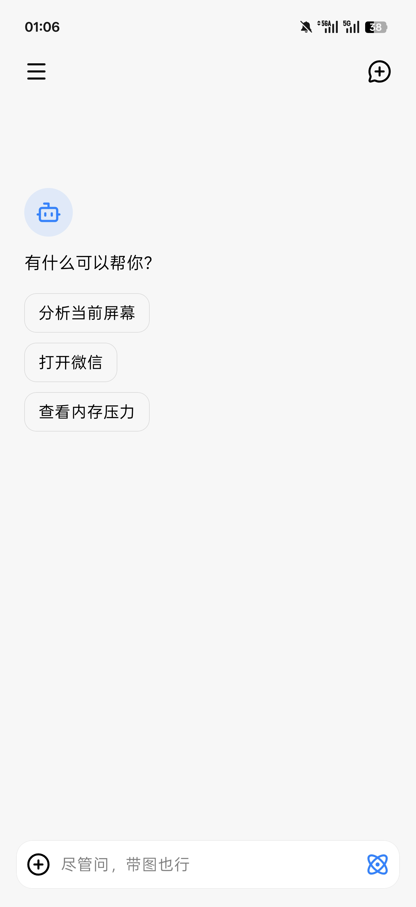
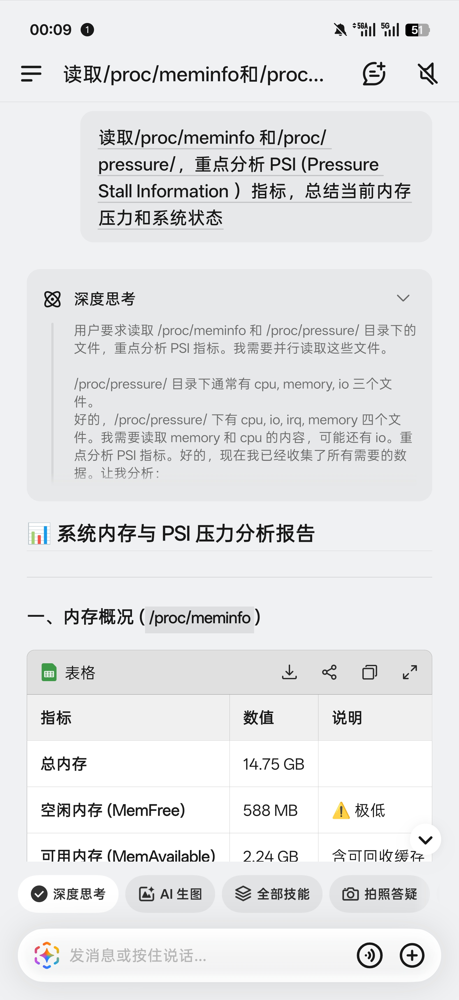
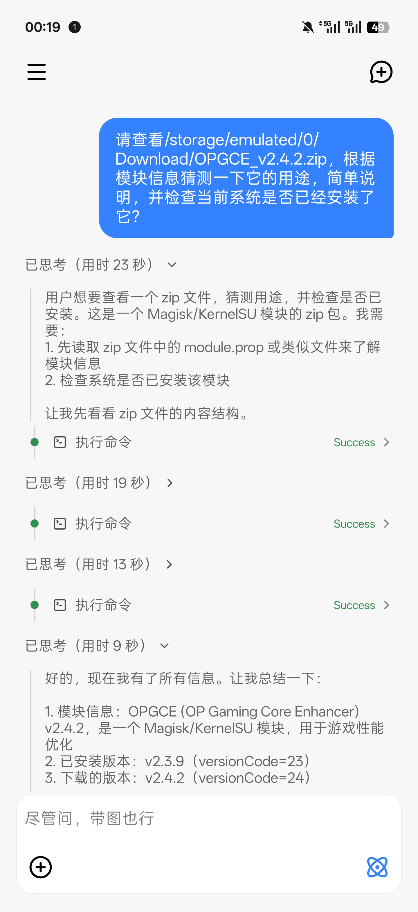
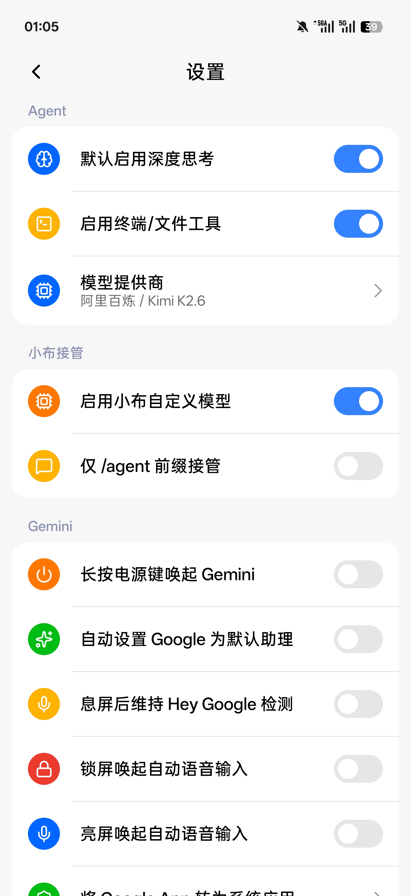
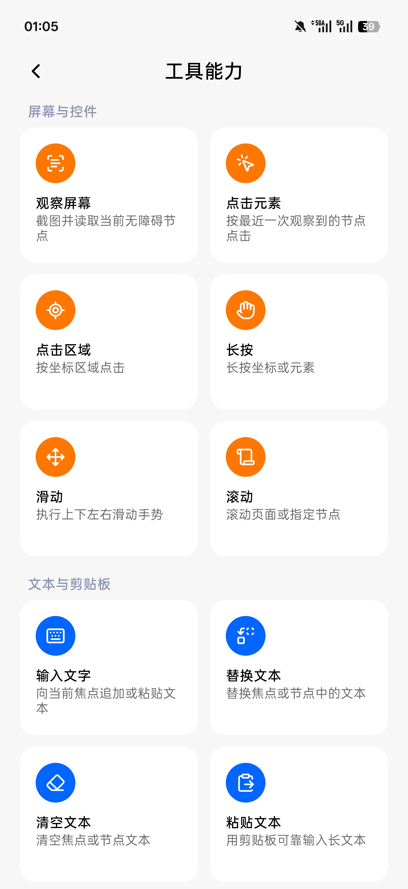
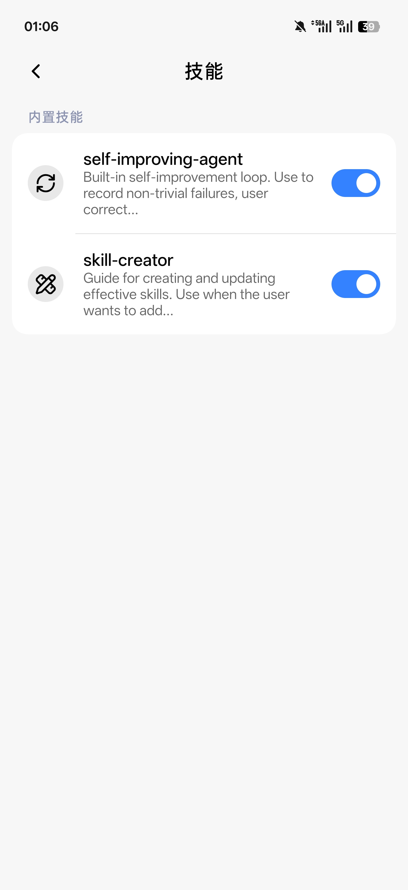

# 暂用名：FuckAndes

第三方系统级手机 AI Agent，把模型、工具、屏幕理解和 ColorOS 系统入口串起来。

当前项目是一个面向 Android 手机的系统级 Agent 运行环境，类似 Codex，但目标环境从代码库和终端换成了 Android 屏幕、应用、命令行和系统入口。底层基于 [libxposed API 102](https://github.com/libxposed/api) 的 Xposed 模块适配 ColorOS 16，把电源键、小布、SystemUI 手势、ColorDirect 识屏、Google 语音助理等系统级入口接到 Agent 上。早期目标是解放被小布占住的系统入口、解锁 Google Gemini / 一圈即搜；现在重点已经转向 App 本体和 Agent 执行能力。

与普通端侧 AI 助手不同，我们不只是一个运行在沙盒里的聊天 App。项目通过 Xposed Hook、root、无障碍服务、系统浮层和系统设置修复，把第三方 Agent 接到电源键、小布、SystemUI 手势、ColorDirect 识屏、Google 语音助理等系统级入口上。

## 界面预览

| GUI Agent 演示 | 小布助手 BYOK：电源键启动 |
|:---:|:---:|
|  |  |

| App本体聊天首页 | 小布 BYOK：系统内存分析 | 命令执行 |
|:---:|:---:|:---:|
|  |  |  |

| 设置 | 工具能力 | 技能管理 |
|:---:|:---:|:---:|
|  |  |  |

## 产品定位

当前项目要做的不是“换一个聊天机器人”，而是做一个能在手机上执行任务的第三方系统级 Agent 运行环境：

- **灵感来自豆包手机助手**：它展示了手机 AI 从聊天框走向系统级操作的方向——语音/按键唤醒、识屏理解、跨 App 执行任务、运行中可见、用户可接管。
- **比豆包手机助手走得更远**：除了识屏和跨 App GUI 操作，我们还把终端执行、文件读写、root shell 和本地自动化放进 Agent Runtime。能执行命令就意味着它不只是手机助手，而是接近主流 Coding Agent 的本机执行环境。
- **核心 Agent Loop 参考 Pi Coding Agent**：早期的 Agent Loop 参考了 [Pi Coding Agent](https://github.com/earendil-works/pi) 的形态：模型输出工具调用，运行时执行工具，把结果写回上下文，再进入下一轮推理。当前实现是串行轮次循环，没有完整复刻 Pi 的并行工具调度和 follow-up 队列；不同之处在于 Pi 面向代码仓库和终端，我们把它迁移到 Android 屏幕、无障碍节点、系统入口和本机 shell 上。
- **App 本体是主入口**：在 App 内发起对话、选择模型、查看运行轨迹、管理会话、配置工具和技能。
- **Agent Runtime 是核心**：模型调用、工具调度、屏幕观察、控件操作、终端/文件工具、运行浮层和结果归档都在模块进程内完成。
- **小布助手是系统级入口之一**：接管小布对话入口后，把系统级唤醒、图片上下文和对话请求交给同一套 Agent Runtime。
- **Gemini / 一圈即搜**：保留早期入口接管能力，但它们不再是项目重点，只是对 ColorOS 体验的补丁和兜底。
- **BYOK**：用户使用自己的模型服务账号、API Key 和 Endpoint，让 Agent 能力跟随用户选择的模型，而不是被内置模型供应限制。
- **交互体验的局限**：我们可以更开放、更激进，但当前项目不是原厂系统组件。系统动画、入口一致性、权限稳定性和部分 UI 细节很难达到厂商内置方案的完成度。

## 痛点

用户花大几千买的旗舰机，AI 体验还不如一个免费的豆包 App，这像话吗？

ColorOS 的小布助手，连针对屏幕内容提问这一个基本需求都做不好。基础模型能力是一切，在手机这种高频图片输入、多模态交互的场景下更是如此。

OPPO 每年投入大量资源做 AI，功能越堆越多，基础模型却还是老样子。系统级入口、识屏、语音唤醒这些能力本来都有，却被绑死在一个不好用的助手上。

豆包手机助手证明了两件事：真正有用的手机 AI 不该只回答问题，而应该在用户授权下理解当前屏幕、跨应用执行任务，并在高风险步骤把控制权交还给用户；以及在国内移动互联网生态里，系统级 Agent 一旦开始跨 App 接管流程，就会撞上超级 App、金融 App、游戏平台和既有风控的墙。

所以主流安卓厂商很难、也不可能做到豆包手机那么激进。微信登录异常、淘宝人机验证、银行 App 风险环境提示，以及豆包后续限制刷激励、金融和游戏场景，都说明这不只是技术问题，而是权限、隐私、安全、商业入口和 App 生态共同作用的结果。厂商要维护预装合作、支付/账号安全、应用商店关系和监管风险，天然会被生态约束绑住手脚。

但这绝不是把基础系统 AI 助手做烂的借口。你可以不替用户自动下单、不碰支付、不代打游戏，也可以在高风险场景强制用户接管；但最基本的模型能力、识屏问答、上下文理解、语音入口，这些本来就应该做好。

我们走的是第三方开发者路线：不代表手机厂商、不需要维护预装商业关系，也不需要把所有限制都内置成保守产品策略。用户愿意解锁、root、启用 Xposed 和无障碍，就应该能把自己的手机入口接给自己选择的 Agent。风险边界由用户决定，工具必须透明可见，敏感操作必须能随时停止、补充和接管。

更进一步，当前项目不只做豆包手机助手展示过的 GUI 代操作。终端执行能力让 Agent 可以直接进入本机命令层：读写文件、执行 shell、调用系统工具、跑构建命令、改配置、查日志、串联脚本和自动化流程。对 Agent 来说，GUI 是手机表层，终端才是接近完整计算环境的入口；一旦模型能在用户授权下执行命令，它就具备了和主流 Coding Agent 同类的“把意图转化为操作”的能力。

## 核心功能

### App 本体：系统级手机 Agent 工作台

- **内置 Agent 聊天**：首屏就是对话界面，支持多轮上下文、Markdown 流式渲染、停止运行、深度思考开关和图片附件。
- **对话持久化**：会话、消息、标题、更新时间和当前选中会话持久化到 Room，支持会话列表、搜索、重命名和删除。
- **运行时状态可见**：模型文本、推理内容、工具调用、token 用量、补充输入和最终结果都会实时转为多轮 assistant 消息展示在会话中，而不是只显示一段最终文本。
- **全局运行浮层**：Agent 执行前台操作时显示分层浮窗、触控/滑动反馈和结果卡片，避免后台无提示自动化操作。
- **外部入口归档**：从小布等外部入口触发的运行结果会归档并导入到 App 会话里，App 进程被杀后也会尝试恢复未返回结果。
- **Codex-like 工作流**：用线程/会话承载任务，用工具执行动作，用运行轨迹展示过程，用权限和浮层控制风险；区别是目标环境从代码库和开发终端扩展到 Android 手机。
- **本机命令执行**：通过会话式 shell 和文件工具执行 `user/root` 命令，让 Agent 能处理日志、配置、脚本、构建、调试和系统自动化，而不只是点屏幕。

### Agent 执行循环

当前核心 Agent 循环由 `AgentModelClient.complete()` 驱动，是一个串行轮次循环：

- **构造上下文**：系统提示词、会话历史、用户 prompt、图片、小布图片上下文和 Skills 索引一起组成 `messages`，工具列表按配置注入；终端/文件工具只有开启后才暴露给模型。
- **模型轮次**：每轮向当前模型提供商发送 `messages + tools`，流式接收文本、推理内容、工具调用和 token 用量，并同步到 App 会话与运行浮层。
- **顺序工具执行**：模型返回 tool calls 后，运行时按顺序执行本地工具，包括识屏、点击、滑动、输入、启动 App、系统面板、Skills 读取和终端/文件工具；当前没有并行执行同一轮工具调用。
- **结果回写**：每个工具结果以 `role=tool` 写回 `messages`；如果工具返回截图，还会额外追加一条带图片的屏幕观察消息，再进入下一轮模型调用。
- **结束条件**：只要还有工具调用就继续下一轮；没有工具调用且模型返回非空最终文本时结束，并把 transcript 归档到会话历史。
- **补充与中断**：运行中补充输入会通过 `AgentRunController.steer()` 取消当前阻塞资源，在检查点把补充内容作为新的用户消息写入上下文后继续；停止运行会通过 `cancel()` 让检查点抛出取消异常。任务完成后的补充会基于上一轮的 prompt 和 assistant 结果创建新的续接运行。
- **用户可控**：运行浮层展示前台操作，支持停止运行、暂停/继续、补充输入和手动接管；涉及支付、隐私或账号安全的流程应交回用户确认。
- **系统入口接管**：小布、电源键、手势条长按、双指识屏和 Google 语音相关入口会按配置转交给当前项目，或被替换为更可用的系统能力。

### 本机工具

Agent Runtime 暴露了一组面向 Android GUI 的本地工具：

- **屏幕与控件**：截图与无障碍节点观察、按节点/坐标点击、区域点击、长按、滑动、滚动。
- **文本与剪贴板**：输入、替换、清空、设置/读取剪贴板、粘贴、等待文本出现。
- **应用与系统**：搜索应用、启动 App、打开 URI、返回/主页/最近任务等按键、打开通知栏和快捷设置等系统面板。
- **终端与文件**：会话式 `user/root` shell、执行命令、读取文件、写入文件、列目录。该能力默认关闭，需要在设置中手动开启“启用终端/文件工具”。
- **技能系统**：内置技能索引、按需读取和启停管理，当前内置 `self-improving-agent` 与 `skill-creator`。

### 终端与文件系统

终端工具是当前项目超越普通手机 GUI 助手的关键能力。开启后，Agent 不只是“点屏幕”，还可以进入 Android 本机命令层：

- **会话式 shell**：`terminal` 支持 `open` 创建持久 `session_id`，后续 `exec` 复用同一个 `user/root` shell、cwd 和环境；一次性命令可用 `open_and_exec` 或 `run_command`。
- **异步任务**：长时间命令可以 `async=true` 启动为独立后台 shell，立即返回 `job_id`；模型再用 `read_async_result` 按 `offset_chars / max_chars` 分段读取输出，完成后可 `close_if_done` 清理。
- **stdout / stderr 分流**：命令结果保留 `stdout`、`stderr`、`exit_code`、`timed_out`、`cwd` 等结构化字段；持久 session 通过 `__ANDES_STATUS_*` marker 分隔命令输出、退出码和当前目录，避免把 shell 状态猜成自然语言。
- **输出截断防护**：普通命令输出默认截到 16K 字符，异步任务最多保留 64K 字符；文件读取限制到 256KB，写入限制到 512KB，目录列表限制到 200 项，避免模型或异常命令把进程内存撑爆。
- **路径安全与命令注入防护**：相对路径默认落到 `/data/local/tmp/fuck_andes`，`~` 映射到用户存储目录；文件路径会做归一化并通过 shell quoting 进入命令，减少路径空格、引号和特殊字符导致的执行错误。
- **Root 能力面**：终端可选择 `identity=user/root`。这让 Agent 能查日志、看系统属性、读写本地文件、跑脚本、改配置和排查 Android 环境，也意味着该能力必须由用户显式开启并自行承担模型可信度风险。

### 运行浮层与状态呈现

- **统一事件流**：运行时把 `RunStarted`、`RoundStarted`、`AssistantBlockDelta`、`ToolStarted`、`ToolFinished`、`UserSupplementReceived`、`RunFinished`、`RunFailed` 等 15 种 `AgentEvent` 当作统一运行轨迹，分别同步到 App 会话、运行浮层和外部入口归档。
- **四层浮层**：前台操作时按需显示 `Glow` 屏幕四周彩虹边框（同时压暗主体）、`Orb` 呼吸球体、`Bubble` 控制气泡和 `ResultCard` 半屏结果卡。运行中显示轻量状态和控制入口，完成后撤掉光球/气泡，改用结果卡展示最终内容。
- **显示规则**：纯聊天、推理、文件读取、技能读取和应用搜索主要留在会话里；`observe_screen`、启动应用、打开 URI、点击、滑动、输入、按键和系统面板等会检查或驱动前台界面的工具才触发全局浮层。
- **手势反馈**：点击、区域点击、节点点击、长按和滑动工具会额外显示 `GestureIndicator`，把模型正在点哪里、怎么滑展示给用户。

### 模型提供商与 BYOK

- **OpenAI-compatible 与 Anthropic 双协议**：运行时支持 OpenAI Chat Completions 风格 SSE、Anthropic Messages API、流式文本、流式工具调用、图片输入和推理内容。
- **内置提供商**：OpenAI、Anthropic、阿里百炼、DeepSeek、Kimi、MiMo、MiniMax、StepFun、硅基流动、OpenRouter。
- **模型提供商管理页**：支持搜索、选择当前提供商、创建自定义 OpenAI-compatible / Anthropic 提供商、复制、删除、重置内置提供商。
- **模型管理**：支持内置官方模型目录、远程拉取模型列表、自定义模型、模型启停和当前模型选择。
- **请求定制**：支持自定义 Base URL、API Key、系统提示词、Anthropic version、自定义请求头、自定义 body 和额外 body JSON。
- **App 本体 BYOK**：当前 App 已经允许用户配置自己的 API Key、Base URL 和模型列表，本质上就是面向 Agent 工作台的 BYOK 模式。
- **小布 BYOK**：小布入口已经支持用户接入自定义模型，并把小布对话请求交给同一套 Agent Runtime，而不是只做简单的模型转发。

### 小布入口接管

- **小布自定义模型**：可启用“小布自定义模型”，默认只在 `/agent` 前缀下接管，避免误伤普通小布请求。
- **图片上下文交接**：小布入口解析图片上下文后，交给 Agent Runtime 处理多模态请求。
- **运行归档**：小布入口触发的运行会归档到 App 会话，方便回到 App 本体继续查看、追问和管理。
- **真正 Agent 能力路线**：小布不是另一个聊天 UI，而是系统级入口。当前已经能接入 BYOK 模型配置，并会继续增强屏幕观察、控件操作和工具调用能力。

### Gemini 与一圈即搜

- **电源键长按唤起 Gemini**：拦截系统分发给小布的电源键长按消息，优先走 Google `voiceinteraction`。如果默认数字助理不是 Google，会自动恢复绑定，并在服务重建期间做有限延迟重试。
- **锁屏/亮屏自动语音输入**：Gemini 浮窗偶发只显示输入框时，模块会补发 `ACTION_VOICE_COMMAND`，减少手动点麦克风。
- **息屏后维持 Hey Google 检测**：在 ColorOS 停掉 Google 软件热词检测后，模块会在息屏事件后尝试恢复已有 hotword session。
- **手势条长按 / 双指识屏触发一圈即搜**：拦截 SystemUI 手势条长按和 ColorDirectService 双指识屏入口，改为调用 Android `contextual_search` 服务。
- **Google App 资格补齐**：仅在 Google App 进程内伪装关键设备和资格属性，放开一圈即搜能力，不改系统文件。
- **Google App 系统化**：内置 Magisk / KernelSU 模块安装器，可将 Google App 转为系统 `priv-app`，改善语音唤醒和后台限制。该操作需用户手动确认并重启生效。

### 权限与自恢复

- **权限健康页**：检查后台运行、悬浮窗、应用列表读取、无障碍辅助和 root 状态，并提供跳转入口。
- **无障碍增强工具**：Agent 使用无障碍读取 UI 节点并执行部分交互。
- **开机/升级后恢复无障碍**：接收 `BOOT_COMPLETED` 与 `MY_PACKAGE_REPLACED` 后，通过 root 尝试重新写入无障碍服务配置。

## 配置界面

模块安装后桌面出现当前模块的 App 图标。UI 基于 Miuix 0.9.3、Navigation 3、Lucide 图标和 ColorOS 风格分组。

主要页面：

- **聊天首页**：对话、图片附件、深度思考、运行状态和会话侧栏。
- **工具能力**：展示 Agent 可调用的屏幕、文本、应用、终端与文件工具。
- **技能**：启停、删除、重新安装内置技能。
- **权限健康**：检查运行所需权限。
- **设置**：Agent、模型与 BYOK、小布接管、Gemini、一圈即搜、权限和关于。
- **模型提供商**：管理提供商、模型、API Key 和请求参数。

Hook 开关通过 libxposed RemotePreferences 写入 LSPosed 数据库；Hook 进程在入口回调和延迟任务执行前读取当前配置，因此配置切换后下一次触发即按新状态执行。模型提供商、模型、会话、运行归档和技能索引使用 Room 数据库持久化。

## 实现概览

模块按进程分发 Hook：

- `system_server`：电源键接管、默认助理恢复、hotword self-heal、contextual_search 服务补齐。
- `com.android.systemui`：手势条长按识屏转发一圈即搜。
- `com.coloros.colordirectservice`：双指识屏转发一圈即搜。
- `com.google.android.googlequicksearchbox`：Google 资格补齐、设备属性伪装、Gemini 语音输入补偿。
- `com.heytap.speechassist`：小布对话入口接管、图片上下文解析、BYOK / Agent Runtime 交接。
- `fuck.andes`：Compose UI、Agent Runtime 服务、模型提供商、模型、技能、会话数据层。

Agent Runtime 是三层多进程架构：

- **入口进程**：`system_server`、SystemUI、ColorDirectService、Google App 和小布进程只做 Hook、上下文提取和请求转发，避免在目标进程里跑模型、网络和复杂工具逻辑。
- **IPC 边界**：入口通过 `Messenger + Bundle` 调用 `AgentRuntimeService`，发送 start / cancel / ack / drain 请求；运行事件和结果通过同一套协议回传。
- **模块进程 Runtime**：`AgentRuntimeService` 负责创建 `AgentRunController`、加载模型配置和 Skills、绑定本地工具、驱动 `AgentModelClient.complete()` 的串行轮次循环、展示浮层、归档 transcript 和外部入口结果。

模型循环不是一次问答，而是 `while true` 多轮工具调用：构造 `messages + tools`，请求模型，解析 tool calls，顺序执行本地工具，把 `role=tool` 结果和必要的屏幕截图写回上下文；直到模型不再调用工具并返回最终文本。`AgentEvent` 流贯穿模型、工具、浮层和会话展示，让 UI 直接反映运行时状态，而不是等结束后再根据文本反推过程。

更多旧入口接管细节见 [docs/TECHNICAL.md](docs/TECHNICAL.md)。该文档主要记录 Gemini、一圈即搜和 RemotePreferences 链路，Agent Runtime 以后会单独补充技术文档。

## 项目结构

核心代码在 `app/src/main/kotlin/fuck/andes/`：

```text
ModuleMain.kt                         Xposed 模块入口，按进程分发 Hook
FuckAndesApp.kt                       App Application，初始化数据层并连接 XposedService

hook/system/                          system_server Hook
hook/google/                          Google App 进程 Hook
hook/colordirect/                     ColorDirectService Hook
hook/breeno/                          小布入口接管

agent/runtime/                        AgentRuntimeService、跨进程协议、结果归档
agent/model/                          模型提供商抽象、OpenAI-compatible、Anthropic、SSE 解析
agent/tool/                           Android 本地工具执行器
agent/device/                         root / 无障碍 / input 驱动的设备控制
agent/terminal/                       会话式 shell 与文件工具
agent/overlay/                        运行浮层、手势反馈和结果卡片
agent/skill/                          技能解析、索引、按需读取
agent/accessibility/                  无障碍服务与开机/升级恢复

data/db/                              Room v6：会话、模型提供商、运行归档、技能索引
data/repository/                      Provider、Model、RuntimeConfig 仓库
data/provider/                        内置模型提供商与官方模型目录

ui/app/                               App 根状态、导航、会话与消息展示
ui/screens/                           首页、工具、技能、权限、系统增强页面
ui.pages/providers/                   模型提供商 / 模型管理页面
ui/components/                        聊天、侧栏、Scaffold、状态卡片等通用组件
systemizer/                           Google App 系统化安装器
config/Prefs.kt                       RemotePreferences 配置中枢
```

## 构建

环境要求：

- Android Studio / Gradle 可用
- JDK 25 toolchain
- Android Gradle Plugin 9.2.1
- Kotlin 2.4.0
- Android SDK 37

常用命令：

```bash
./gradlew assembleDebug
./gradlew testDebugUnitTest
./gradlew assembleRelease
```

Release 构建启用 R8 和资源裁剪，并合并 `META-INF/xposed/*` 以保留模块声明。

## 安装与使用

1. 在支持 libxposed API 102 的 LSPosed 环境中安装 APK。
2. 在 LSPosed 中启用模块，作用域包含 `system`、`SystemUI`、Google App、ColorDirectService 和小布。
3. 重启手机。
4. 打开模块 App，进入设置页配置模型提供商、API Key 和当前模型。
5. 授予悬浮窗、无障碍、应用列表读取、后台运行等权限；需要终端/文件工具或无障碍自恢复时还需要 root。
6. 按需开启小布接管、Gemini、一圈即搜和终端/文件工具。

## 当前限制

- 目标系统是 ColorOS 16 / Android 16，Hook 点强依赖 OPPO / Google App 当前实现，系统或 App 大版本更新后可能需要重新适配。
- 第三方模块无法获得原厂系统组件的全部私有权限和设计资源，交互 UI、动画衔接、系统级一致性和跨设备体验会弱于厂商内置方案。
- OpenAI-compatible 运行时当前使用 Chat Completions；Responses API 只保留配置位。
- 终端与文件工具默认关闭，开启后模型具备更高权限，需要自行控制模型提供商与系统提示词可信度。
