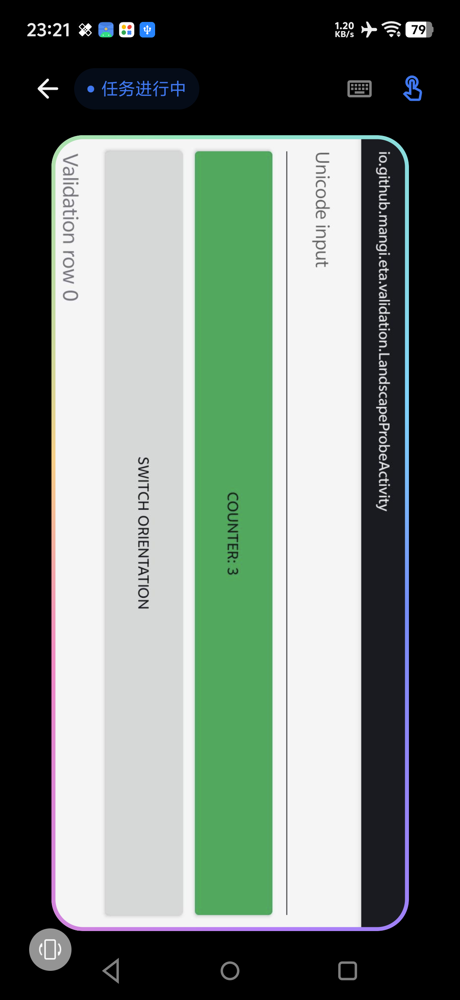
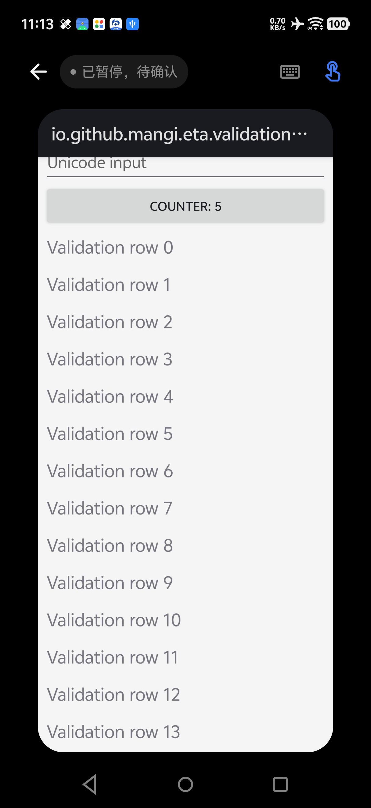

# 2026-10-09 更新说明

本次更新改善虚拟屏任务的执行与恢复，并增加批量工具调用。完整行为变化和验证范围如下。

## 批量工具执行

- 新增 `batch`，每批接受 1–8 项。`auto` 模式批量执行独立只读查询，最多同时 4 项；`sequential` 模式严格按顺序执行当前已公开的工具，包括界面操作、文件写入、终端和动态 MCP 工具。
- 顺序模式默认首项失败后停止，后续项标记为未执行。独立步骤可显式设置 `on_error=continue`；取消和可信虚拟屏暂停始终停止后续步骤。
- 执行前对整批参数及每项工具 Schema 做预检，执行时沿用各工具开关、Root 和系统权限检查。嵌套 batch 和本轮未公开的工具不可调用。
- 保存脱敏执行进度，区分已完成、失败、跳过、执行状态未知与尚未开始的步骤，供中断恢复时核对；不保存子调用参数或原始结果。本地进度字段不会作为额外字段发给模型接口。
- 工具能力页的“应用与系统”分组增加“批量执行”，并同步英文、简体中文、繁体中文名称、说明、图标及模型提示。
- 依赖上一步返回值才能确定参数时，仍需等待结果后发起下一批。异步工具返回仅代表提交顺序，不代表后台任务已经完成。

调用合同、范围与恢复语义见 [批量工具调用](TOOL_BATCH.md)。

## 虚拟屏横屏适配

- 横屏应用使用实际横向 display 的逻辑宽高；在竖向查看页中顺时针旋转 90°，按旋转后的尺寸适配可用区域。
- 点击、长按、滑动与操作指示同步转换坐标。旋转、尺寸或会话变化后取消旧触摸、清理旧观察和手势，避免继续使用过期坐标。
- 熄屏运行时，显示唤醒锁只绑定已确认独立的虚拟显示组，保持虚拟屏方向变化与触控处理。

实机查看页截图：

## 无响应保护和一次自动恢复

- 同一目标连续无效果操作、持续未变化的观察、目标输入连接明确无响应或输入超时，触发可信保护性暂停，停止同批后续工具并保留现场。
- 对 `UI_NO_PROGRESS`、`UI_APP_UNRESPONSIVE`、`UI_INPUT_TIMEOUT`，运行器先尝试重启当前虚拟屏应用一次，并重新观察，让模型根据新现场继续任务；此前效果未确认的动作需先核实。
- 恢复失败或再次暂停时，本轮停止并保留虚拟屏。会话与助手浮层显示“已暂停，待确认”，保护性暂停不再归类为普通 Runtime 失败。
- 暂停分类在结果传输、待交付结果、归档和会话恢复中保存。数据库版本由 24 升至 25，迁移为结果及归档增加 `errorCode` 列。
- 静止截图、空 UI 树或帧龄不足以单独判定应用卡死；输入完成也不等于业务动作已生效。

实机暂停状态截图：

## 10 帧预览和后台按需抓帧

- 查看页预览编码和轮询间隔均改为 100ms，最多 10 帧/秒。实际显示帧率仍受编码、传输和解码耗时影响。
- 用户未打开查看页或切出时停止持续编码；后台模型观察按需生成一帧，静态应用也能重新观察，完成后立即停止编码。
- 后台只保留最新原始缓冲。查看器使用独立身份和 Root 端心跳租约，延迟退出不能关闭新查看器，失去心跳后停止持续编码。
- 隐藏、旋转和重启使旧帧失效；重启等待新画面。查看器可见状态不重置任务状态或空闲清理计时，缺树时的进展检查继续按需获取图像证据。

实现和测量方法见 [抓帧验证报告](FRAME_CAPTURE_2026-10-09.md)。

## 验证与交付

开发环境为 JDK 25、Android SDK 37。

- 最终全量 JVM 回归共 1715 项，0 失败、0 错误、2 项既有跳过；包含数据库迁移、权限边界、恢复、批量执行与工具能力卡片检查。
- 随后补充 OpenAI 请求中的本地进度字段过滤，重新验证 batch、会话编解码、Agent loop 和 Chat Completions Provider 共 67 项，全部通过。
- 最终 Debug 构建与 Android Lint 通过；Lint 为 0 错误、397 条警告、1 条提示。抓帧阶段的测试 APK 与 Release/R8 构建也通过；最终顺序 batch 的远程 Release 构建由本次 push 触发的工作流验证。
- vivo V2419A、Android 16 / OriginOS、KernelSU / LSPosed 上的独立构造应用验证包括：防循环 46 项、核心回归 82 项、熄屏方向与恢复 42 项、按需抓帧 63 项、后台恢复 38 项；详细覆盖范围和各阶段记录见 [10 月 8 日测试报告](TEST_REPORT_2026-10-08.md) 与抓帧报告。
- 抓帧脚本在 1525ms 内编码 15 帧，隐藏预览和失去心跳后均停止持续编码。该测量使用模拟查看器心跳，不代表实体查看页端到端帧率。
- 最终 Debug APK 已通过无线 ADB 覆盖安装到手机，安装文件与本地构建的 SHA-256 一致：`58064a2044758fc4c08893f6ee49bb389581df9ca1846d0b73cc83775a3ce66a`。

batch 的顺序工具调用使用 JVM 回归验证，能力卡片使用 Robolectric 验证；本次未让真实模型在手机上执行 GUI、写入或 MCP 操作。各真机专项使用独立构造应用，临时设置已恢复、虚拟显示已释放、测试 APK 已卸载。其他 ROM 和真实业务流程仍需单独验证。
